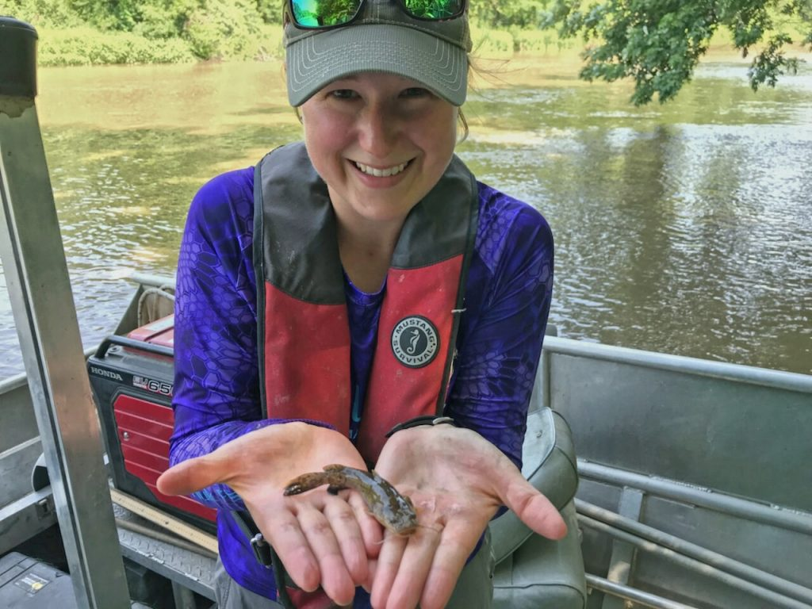

{width=20%}

*****

# Homework Assignments 

Homework Week 1 *Nothing Due*

[Homework Week 2](Homework2.html): First .html

[Homework Week 3](Homework3.html): Regular Expressions 

Homework Week 4: [Typora](file:///C:/Users/Kris/Documents/Computational%20Biology_R/Homeworks/HW4_Typora_Webpage.html),
[LaTeX Letter](Letter_Template.pdf), and
[LaTeX Beammer Presentation](BeamerSlideShow.pdf)

[Homework Week 5](Homework5_Page.html): Atomic Vectors 